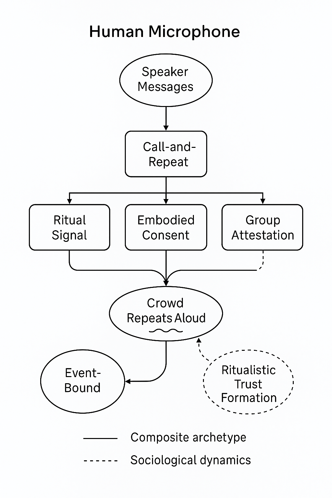

# Trust Interoperability Standard v1

> **Provenance note:** This document preserves historical naming from earlier drafts. References such as `Abracadabradoo`, `DeepTrust`, or `Dialogica` may indicate legacy project names, source-document context, or sibling protocol material rather than current public positioning.
Version 1.0

Date: May 03, 2025

[Chapter 1: Introduction and Purpose [6](#chapter-1-introduction-and-purpose)](#chapter-1-introduction-and-purpose)

[1.1 What Is Trust Interoperability? [6](#what-is-trust-interoperability)](#what-is-trust-interoperability)

[1.2 Why We Need a Standard [6](#why-we-need-a-standard)](#why-we-need-a-standard)

[1.3 Philosophy: Ritual-Aware, Consent-Centric, Cryptographically Optional [6](#philosophy-ritual-aware-consent-centric-cryptographically-optional)](#philosophy-ritual-aware-consent-centric-cryptographically-optional)

[1.4 Who This Is For [7](#who-this-is-for)](#who-this-is-for)

[1.5 Scope of This Document [7](#scope-of-this-document)](#scope-of-this-document)

[1.6 Not In Scope [7](#not-in-scope)](#not-in-scope)

[Chapter 2: The Trust Object Model [9](#chapter-2-the-trust-object-model)](#chapter-2-the-trust-object-model)

[2.1 The Anatomy of a Trust Exchange [9](#the-anatomy-of-a-trust-exchange)](#the-anatomy-of-a-trust-exchange)

[2.2 What Is a Trust Object Archetype (TOA)? [9](#what-is-a-trust-object-archetype-toa)](#what-is-a-trust-object-archetype-toa)

[2.3 Archetypes Are Not Protocols [10](#archetypes-are-not-protocols)](#archetypes-are-not-protocols)

[2.4 Archetype Interchange and Transformation [10](#archetype-interchange-and-transformation)](#archetype-interchange-and-transformation)

[2.5 Visual Model: Trust Object Lifecycle [10](#visual-model-trust-object-lifecycle)](#visual-model-trust-object-lifecycle)

[2.6 Social, Symbolic, and Cryptographic Trust Are Equal Citizens [11](#social-symbolic-and-cryptographic-trust-are-equal-citizens)](#social-symbolic-and-cryptographic-trust-are-equal-citizens)

[Chapter 3: Archetype Specification Format [12](#_Toc197123559)](#_Toc197123559)

[Chapter 3: Archetype Specification Format [12](#chapter-3-archetype-specification-format)](#chapter-3-archetype-specification-format)

[3.1 Purpose of the Specification Format [12](#purpose-of-the-specification-format)](#purpose-of-the-specification-format)

[3.2 Required Fields for a TOA [12](#required-fields-for-a-toa)](#required-fields-for-a-toa)

[3.3 Optional Fields and Extensions [13](#optional-fields-and-extensions)](#optional-fields-and-extensions)

[🔧 Extensions and Future-proofing [14](#extensions-and-future-proofing)](#extensions-and-future-proofing)

[3.4 Format Examples [14](#format-examples)](#format-examples)

[3.5 Versioning Rules [15](#versioning-rules)](#versioning-rules)

[3.6 Format Examples [15](#format-examples-1)](#format-examples-1)

[Trust Archetype: TotemSync (v1) [15](#trust-archetype-totemsync-v1)](#trust-archetype-totemsync-v1)

[Trust Archetype: PhrasePair (v1) [16](#trust-archetype-phrasepair-v1)](#trust-archetype-phrasepair-v1)

[Trust Archetype: QRMirror (v1) [17](#trust-archetype-qrmirror-v1)](#trust-archetype-qrmirror-v1)

[Trust Archetype: SpiritLink (v1) [18](#trust-archetype-spiritlink-v1)](#trust-archetype-spiritlink-v1)

[Trust Archetype: KeyCast (v1) [20](#trust-archetype-keycast-v1)](#trust-archetype-keycast-v1)

[Trust Archetype: DelegateBond (v1) [21](#trust-archetype-delegatebond-v1)](#trust-archetype-delegatebond-v1)

[Trust Archetype: ThreadLink (v1) [22](#trust-archetype-threadlink-v1)](#trust-archetype-threadlink-v1)

[Trust Archetype: DialogAnchor (v1) [23](#trust-archetype-dialoganchor-v1)](#trust-archetype-dialoganchor-v1)

[Summary: Interoperable Trust Ecosystem (v1) [24](#summary-interoperable-trust-ecosystem-v1)](#summary-interoperable-trust-ecosystem-v1)

[3.6 Machine-readable Formats [25](#machine-readable-formats)](#machine-readable-formats)

[Trust Object Archetype (TOA) – YAML Format [25](#trust-object-archetype-toa-yaml-format)](#trust-object-archetype-toa-yaml-format)

[JSON Equivalent [26](#json-equivalent)](#json-equivalent)

[Extensibility and Interop Suggestions [27](#extensibility-and-interop-suggestions)](#extensibility-and-interop-suggestions)

[Handling Extensions in Code [28](#handling-extensions-in-code)](#handling-extensions-in-code)

[Chapter 4: Core Archetype Catalog (v1) [29](#_Toc197123582)](#_Toc197123582)

[4.1 Purpose of the Catalog [29](#_Toc197123583)](#_Toc197123583)

[4.2 Archetypes Included in v1 Catalog [29](#_Toc197123584)](#_Toc197123584)

[4.3 Archetype Previews [30](#_Toc197123585)](#_Toc197123585)

[4.4 Catalog Extension and Governance [31](#_Toc197123586)](#_Toc197123586)

[Chapter 5: Consent Models and Social Contexts [31](#_Toc197123587)](#_Toc197123587)

[5.1 Why Consent Matters in Trust Interoperability [32](#why-consent-matters-in-trust-interoperability)](#why-consent-matters-in-trust-interoperability)

[5.2 The Consent Spectrum [32](#the-consent-spectrum)](#the-consent-spectrum)

[5.3 Consent as Social Technology [33](#consent-as-social-technology)](#consent-as-social-technology)

[5.4 Multimodal Consent in Practice [33](#multimodal-consent-in-practice)](#multimodal-consent-in-practice)

[Example: dialog-anchor.v1 [33](#example-dialog-anchor.v1)](#example-dialog-anchor.v1)

[5.5 Group and Delegated Consent [33](#group-and-delegated-consent)](#group-and-delegated-consent)

[5.6 Consent and Revocation [34](#consent-and-revocation)](#consent-and-revocation)

[5.7 UX and Consent Signaling [34](#ux-and-consent-signaling)](#ux-and-consent-signaling)

[Chapter 6: Cryptographic Layers [35](#chapter-6-cryptographic-layers)](#chapter-6-cryptographic-layers)

[6.1 Cryptography as Optional but Expressive [35](#cryptography-as-optional-but-expressive)](#cryptography-as-optional-but-expressive)

[6.2 Types of Cryptographic Basis [35](#types-of-cryptographic-basis)](#types-of-cryptographic-basis)

[6.3 Example Archetype Layers [36](#example-archetype-layers)](#example-archetype-layers)

[6.4 Forward Secrecy and Ephemeral Trust [36](#forward-secrecy-and-ephemeral-trust)](#forward-secrecy-and-ephemeral-trust)

[6.5 Zero-Knowledge Extensions (ZK-TIS) [36](#zero-knowledge-extensions-zk-tis)](#zero-knowledge-extensions-zk-tis)

[6.6 Key Lifecycle and Revocation [37](#key-lifecycle-and-revocation)](#key-lifecycle-and-revocation)

[6.7 Implementation Guidance [37](#implementation-guidance)](#implementation-guidance)

[Chapter 7: Practical Constraints and UX Considerations [39](#chapter-7-practical-constraints-and-ux-considerations)](#chapter-7-practical-constraints-and-ux-considerations)

[7.1 Why Practicality Shapes Trust [39](#why-practicality-shapes-trust)](#why-practicality-shapes-trust)

[7.2 Environmental Constraints [39](#environmental-constraints)](#environmental-constraints)

[7.3 UX Patterns for Trust Signals [40](#ux-patterns-for-trust-signals)](#ux-patterns-for-trust-signals)

[7.4 Accessibility Considerations [40](#accessibility-considerations)](#accessibility-considerations)

[7.5 Error Handling and Recovery [41](#error-handling-and-recovery)](#error-handling-and-recovery)

[7.6 UX for Revocation and Reflection [41](#ux-for-revocation-and-reflection)](#ux-for-revocation-and-reflection)

[7.7 Protocol-Level Guidance [41](#protocol-level-guidance)](#protocol-level-guidance)

[Chapter 8: Auditing, Logging, and Traceability [43](#chapter-8-auditing-logging-and-traceability)](#chapter-8-auditing-logging-and-traceability)

[8.1 What Traceability Means in TIS [43](#what-traceability-means-in-tis)](#what-traceability-means-in-tis)

[8.2 Traceability Models [43](#traceability-models)](#traceability-models)

[8.3 Data Fields in a Trace [43](#data-fields-in-a-trace)](#data-fields-in-a-trace)

[8.4 Privacy-Preserving Logging [44](#privacy-preserving-logging)](#privacy-preserving-logging)

[8.5 Who Has Access to the Trace? [44](#who-has-access-to-the-trace)](#who-has-access-to-the-trace)

[8.6 Revocation and Trace Interaction [45](#revocation-and-trace-interaction)](#revocation-and-trace-interaction)

[8.7 Logging in Dialogica and DeepTrust Contexts [45](#logging-in-dialogica-and-deeptrust-contexts)](#logging-in-dialogica-and-deeptrust-contexts)

[8.8 Example Log Entry (Signed JSON) [46](#example-log-entry-signed-json)](#example-log-entry-signed-json)

[Chapter 9: Versioning and Extension Framework [47](#chapter-9-versioning-and-extension-framework)](#chapter-9-versioning-and-extension-framework)

[9.1 Why Versioning Matters [47](#why-versioning-matters)](#why-versioning-matters)

[9.2 Archetype Versioning Rules [47](#archetype-versioning-rules)](#archetype-versioning-rules)

[Semantics: [47](#semantics)](#semantics)

[9.3 Archetype Extension Fields [47](#archetype-extension-fields)](#archetype-extension-fields)

[9.4 Namespace and Catalog Structure [48](#namespace-and-catalog-structure)](#namespace-and-catalog-structure)

[Format: [48](#format)](#format)

[Examples: [48](#examples)](#examples)

[9.5 Forking and Interoperability [48](#forking-and-interoperability)](#forking-and-interoperability)

[9.6 Extension by Composition [49](#extension-by-composition)](#extension-by-composition)

[9.7 Future Governance Possibilities [49](#future-governance-possibilities)](#future-governance-possibilities)

[Chapter 10: Appendices [51](#chapter-10-appendices)](#chapter-10-appendices)

[Appendix A: TOA Template (YAML Format) [51](#appendix-a-toa-template-yaml-format)](#appendix-a-toa-template-yaml-format)

[Appendix B: JSON-LD Schema (Simplified) [52](#appendix-b-json-ld-schema-simplified)](#appendix-b-json-ld-schema-simplified)

[Appendix C: Ontological Mappings (Selected Fields) [53](#appendix-c-ontological-mappings-selected-fields)](#appendix-c-ontological-mappings-selected-fields)

[Appendix D: Trust Lifecycle Diagram (Textual) [53](#appendix-d-trust-lifecycle-diagram-textual)](#appendix-d-trust-lifecycle-diagram-textual)

[Appendix E: Initial Git Directory Structure [53](#appendix-e-initial-git-directory-structure)](#appendix-e-initial-git-directory-structure)

[Appendix F: Symbolic and Temporal Trust [54](#appendix-f-symbolic-and-temporal-trust)](#appendix-f-symbolic-and-temporal-trust)

[Purpose [54](#purpose)](#purpose)

[Why Symbolic and Temporal Trust Matters [54](#why-symbolic-and-temporal-trust-matters)](#why-symbolic-and-temporal-trust-matters)

[Archetype Examples [54](#archetype-examples)](#archetype-examples)

[spirit-link.v1 [54](#spirit-link.v1)](#spirit-link.v1)

[ritual-signal.v1 [55](#ritual-signal.v1)](#ritual-signal.v1)

[sunset-oath.v1 *(hypothetical)* [55](#sunset-oath.v1-hypothetical)](#sunset-oath.v1-hypothetical)

[first-meeting.v1 *(hypothetical)* [55](#first-meeting.v1-hypothetical)](#first-meeting.v1-hypothetical)

[Temporal Profiles and Ritual Validity [55](#temporal-profiles-and-ritual-validity)](#temporal-profiles-and-ritual-validity)

[Symbolic Anchors [55](#symbolic-anchors)](#symbolic-anchors)

[Implementation Considerations [55](#implementation-considerations)](#implementation-considerations)

[When to Use Symbolic Trust [56](#when-to-use-symbolic-trust)](#when-to-use-symbolic-trust)

[Future Directions [56](#future-directions)](#future-directions)

[Appendix G: Composite Trust Archetypes and Symbolic Interactions [56](#appendix-g-composite-trust-archetypes-and-symbolic-interactions)](#appendix-g-composite-trust-archetypes-and-symbolic-interactions)

[Purpose [56](#purpose-1)](#purpose-1)

[Why Composition Matters [56](#why-composition-matters)](#why-composition-matters)

[Featured Composite: human-microphone.v1 [57](#featured-composite-human-microphone.v1)](#featured-composite-human-microphone.v1)

[Summary [57](#summary)](#summary)

[Compositional Breakdown [57](#compositional-breakdown)](#compositional-breakdown)

[Canonical YAML Representation [57](#canonical-yaml-representation)](#canonical-yaml-representation)

[Diagram: Trust Flow in human-microphone.v1 [58](#diagram-trust-flow-in-human-microphone.v1)](#diagram-trust-flow-in-human-microphone.v1)

[Guidance for Implementers [58](#_Toc197123659)](#_Toc197123659)

[Future Work [58](#future-work)](#future-work)

[Glossary [59](#glossary)](#glossary)

# Chapter 1: Introduction and Purpose

## **1.1 What Is Trust Interoperability?**

*Trust interoperability* is the ability for multiple individuals, systems, agents, or institutions to recognize, extend, and respond to *trust claims*—even when they differ in methods, beliefs, or protocols.

At its core, trust interoperability allows for **multiple trust styles to coexist**, while maintaining **consensual recognition** and **structured expression**. It is not the enforcement of one model of truth or authority, but a framework for *pluralistic trust legibility*.

This standard—**TIS: Trust Interoperability Standard**—creates a semantic and structural layer for describing how trust is instantiated, acknowledged, and optionally audited across many contexts: cryptographic, social, embodied, conversational, and symbolic.

## **1.2 Why We Need a Standard**

Without a shared grammar for trust expression:

- Systems cannot **safely interoperate** across domains (e.g., AI agents talking to humans; DAOs onboarding guests).

- Users must either **commit to a single rigid trust model**, or operate in **opaque, ad hoc** environments.

- We lose the ability to **trace trust back to its roots**: what was agreed upon, how, and when?

By establishing named **Trust Object Archetypes (TOAs)**, we:

- Enable systems to **map one trust method into another**

- Provide a **library of known consent and exchange formats**

- Make trust **auditable where appropriate**, and **symbolic where necessary**

## **1.3 Philosophy: Ritual-Aware, Consent-Centric, Cryptographically Optional**

TIS is founded on a **post-protocol** principle:

Trust is not bound to any one technology. It begins with human recognition, extends to consensual structure, and may or may not involve cryptography.

This standard respects:

- **Consent** as the fundamental substrate of any trust exchange

- **Plurality** of implementation methods: from spoken phrases to zero-knowledge proofs

- **Legibility** as a social good: trust tokens should be inspectable, if intended

- **Graceful degradation**: trust should still be possible even when connectivity, identity, or cryptographic capability is limited

## **1.4 Who This Is For**

TIS is intended for:

- Protocol designers building **agent-human communication systems**

- Communities designing **ephemeral or ritualized trust ceremonies**

- Identity and consent frameworks needing **verifiable trust exchanges**

- Developers of social media, DAO governance, dispute resolution, and AI agent tooling

- Any project seeking to **log or verify trust** in structured, interoperable form

## **1.5 Scope of This Document**

TIS includes:

- A standardized schema for defining **Trust Object Archetypes**

- A growing catalog of named, reusable archetypes (e.g. TotemSync, PhrasePair, QRMirror)

- Guidance for consent signaling, traceability, revocation, and cross-archetype mapping

- Optional interfaces to DID, VC, ZK, and social identity systems

- A vision for **trust across contexts**: from two humans in a room to a distributed civic tribunal

## **1.6 Not In Scope**

TIS *does not*:

- Mandate cryptographic enforcement

- Require a single source of truth or identity

- Replace cultural or community-specific trust practices

- Attempt to universalize “trust” in philosophical terms

Instead, it offers a **structurable grammar** for *trust-as-declared*, *trust-as-consented*, and *trust-as-recorded*.

# Chapter 2: The Trust Object Model

## **2.1 The Anatomy of a Trust Exchange**

Every trust exchange—no matter how complex—can be reduced to a fundamental pattern:

| **Component**     | **Description**                                                                                             |
|-------------------|-------------------------------------------------------------------------------------------------------------|
| **Parties**       | Two or more agents (human or non-human) participating in the exchange                                       |
| **Seeds / Codes** | The *thing* being exchanged, referenced, or agreed upon (e.g., passphrase, key, signal, ritual, credential) |
| **Channel**       | The medium through which the exchange occurs (e.g., QR scan, verbal utterance, signed JSON, ritual dance)   |
| **Consent**       | How the parties *acknowledge*, *accept*, or *engage* with the trust object                                  |
| **Binding**       | The semantic or cryptographic way the trust is *locked in* or *made real*                                   |
| **Trace / Log**   | Optional record of the exchange for future verification, audit, or repudiation                              |

## **2.2 What Is a Trust Object Archetype (TOA)?**

A **Trust Object Archetype** (TOA) is a named, reusable *pattern* for establishing trust. Each archetype defines:

- A **method of exchange** (e.g., QRMirror, PhrasePair)

- The **level of consent** required

- The **expected temporal behavior** (ephemeral, sessional, persistent)

- Its **trust implications** (pseudonymous, verified ID, sacred vow)

- Its **traceability and revocability**

Each TOA becomes a **modular unit** of trust within broader protocols. For example:

- A social app might let users choose from totem-sync.v1 or phrase-pair.v1 to link with a friend.

- A DAO may require a delegate-bond.v1 to grant voting rights to a proxy.

- An AI assistant may only engage in negotiation after exchanging dialog-anchor.v1.

## **2.3 Archetypes Are Not Protocols**

TOAs do not *do* the trust work on their own. Instead, they are **semantic blueprints** for how that work is to be done.

A protocol (e.g., HumanKey, Dialogica) might:

- Instantiate a TOA

- Coordinate its channel and consent mechanism

- Implement logging or revocation logic

- Provide UI/UX affordances for human users

This separation of **archetype** and **protocol** ensures:

- Modularity (archetypes can be reused)

- Interoperability (different systems can agree on what happened)

- Legibility (parties can inspect the trust type without interpreting opaque behavior)

## **2.4 Archetype Interchange and Transformation**

Archetypes are composable and transformable.

Examples:

- A phrase-pair.v1 might be followed up with totem-sync.v1 to deepen the trust layer.

- A delegate-bond.v1 might be re-expressed as a dialog-anchor.v1 when the relationship becomes conversational.

- A system might convert spirit-link.v1 into key-cast.v1 if a ritual outcome needs to be registered on-chain.

This flexibility enables systems to **adapt** to varying levels of assurance, formality, or cultural need—without fragmenting their underlying trust graph.

## **2.5 Visual Model: Trust Object Lifecycle**

We can think of each trust exchange as having a lifecycle:

\[INITIATION\] → \[EXCHANGE\] → \[ACKNOWLEDGMENT\] → \[BINDING\] → \[OPTIONAL TRACE\] → \[OPTIONAL REVOCATION\]

This lifecycle provides hooks for:

- Agent-side automation

- UI signaling (e.g., “trust handshake complete”)

- Logging or snapshotting

- Future reasoning about “how this trust was formed”

## **2.6 Social, Symbolic, and Cryptographic Trust Are Equal Citizens**

The Trust Object Model deliberately places:

- A **TOTP exchange**

- A **sacred ritual**

- A **verbal agreement**  
  …on the same ontological footing.

Each is modeled in terms of:

- What was exchanged

- How consent was given

- Whether trust was traceable or ephemeral

- How revocation might occur

This is what makes TIS *polysemantic* and *pluralistically grounded*: it can support fast-paced pseudonymous apps **and** long-term treaty negotiations **and** spiritual initiations—without reducing any to a lesser form.

# **Chapter 3: Archetype Specification Format**

## **3.1 Purpose of the Specification Format**

The specification format provides a **common schema** for describing any trust archetype in a way that is:

- **Human-readable** for researchers, developers, and designers

- **Machine-readable** for agents, verifiers, protocols, and automated tools

- **Extensible** to accommodate evolving trust methods

- **Interoperable** with adjacent standards (e.g., DIDs, VCs, JSON-LD, ZKPs)

This format is the **lingua franca** of the Trust Interoperability Standard (TIS).

## **3.2 Required Fields for a TOA**

Each **Trust Object Archetype (TOA)** must include the following fields:

| **Field**             | **Description**                                                                                                   |
|-----------------------|-------------------------------------------------------------------------------------------------------------------|
| archetype_id          | A unique identifier in lowercase kebab-case, with semantic version (e.g. totem-sync.v1)                           |
| name                  | A human-friendly name for the archetype                                                                           |
| summary               | A brief description of what the archetype is and when it’s used                                                   |
| exchange_method       | How the exchange occurs: modalities, choreography, steps                                                          |
| cryptographic_basis   | Whether it uses crypto, and if so, which primitive (e.g., TOTP, ECC, none)                                        |
| consent_mode          | How parties signal agreement: explicit, implied, ritual, delegated                                                |
| temporal_profile      | Expected duration: ephemeral, sessional, persistent                                                               |
| practical_constraints | Physical, environmental, or technological constraints                                                             |
| trust_range           | The types of trust this archetype supports (e.g. pseudonymous, institutional, social)                             |
| sociological_mode     | The underlying social structure or ritual basis for the trust exchange (e.g. ritualistic, bureaucratic, dialogic) |
| traceability          | Whether the exchange can be logged, and under what conditions                                                     |
| revocability          | How the trust link can be undone (if at all)                                                                      |
| implementation_notes  | Guidance for developers and integrators                                                                           |
| related_archetypes    | Optional cross-references to similar or complementary TOAs                                                        |
| example_use_cases     | Scenarios where this archetype is useful or canonical                                                             |

## 3.3 Optional Fields and Extensions

Additional fields may be included to support rich interoperability and context-aware trust modeling:

| **Field**      | **Description**                                                                                                                                                                        |
|----------------|----------------------------------------------------------------------------------------------------------------------------------------------------------------------------------------|
| namespace      | Used to scope archetypes (e.g. humankey, dialogica, deeptrust)                                                                                                                         |
| locales        | Translations of name and summary in multiple languages                                                                                                                                 |
| did_support    | Whether and how this archetype supports DID-based identities                                                                                                                           |
| zk_extensions  | Whether zero-knowledge proofs are compatible                                                                                                                                           |
| authz_model    | Optional roles and permissions implied by this archetype                                                                                                                               |
| logging_format | Suggested format or data fields if traceability is enabled                                                                                                                             |
| identity       | Structured identity metadata, based on the Identity Semantics v1 schema. Includes actor_id, identity_model, binding_method, and optional persona_label.                                |
| extensions     | A free-form object for schema experimentation, future upgrades, or implementation-specific metadata. Keys should use a namespaced format (e.g. myproto:fieldName) to avoid collisions. |

These optional fields allow TOAs to plug into systems like:

- DID/VC ecosystems (e.g., W3C standards)

- Smart contract platforms

- Dialogica threads and contextual AI reasoning systems

- DeepTrust audit or challenge flows

- Symbolic or embodied ritual protocols

🔗 **Note:** For full identity modeling, see: Identity Semantics v1

### 🔧 Extensions and Future-proofing

TOAs may optionally include a flexible extensions object to accommodate metadata, future capabilities, or domain-specific tags.

Fields defined within extensions (or any similarly flexible metadata container) **MUST be treated as non-normative** unless **all participating parties** explicitly recognize and agree to their meaning and effects.

- If a party does not recognize an extension key, they **MUST ignore it** without penalty.

- If a protocol or implementation relies on extension keys for behavior, it **MUST negotiate their interpretation explicitly** (e.g. via session negotiation, mutual configuration, or external registry).

- No TOA implementation may infer consent, obligation, or trust depth **solely** from the presence of an unrecognized extension field.

#### 🧪 Example (from dialog-anchor.v1):

extensions:

dialogica:confidence_score: 0.87

ai:language_model_origin: "gpt-4.5-tuned"

zkmeta:proof_hint: "age_over_18"

These values may be used for debugging, visualization, or third-party integration—but they do **not** affect trust status unless explicitly supported.

## 3.4 Format Examples

As shown previously, the default format is **YAML**, with an optional **JSON** serialization. A standard TOA should be stored as a file:

archetypes/

└── totem-sync.v1.yaml

And include this header:

archetype_id: "totem-sync.v1"

name: "TotemSync"

summary: \>

A symmetric trust exchange based on shared TOTP seed and mutual acknowledgment.

...

This allows for:

- Version control (Git, IPFS, etc.)

- Decentralized registries

- Cross-protocol mappings

- Human/AI co-development of new archetypes

## **3.5 Versioning Rules**

- All TOAs must be versioned semantically (.v1, .v2, etc.)

- Breaking changes (e.g., new required fields or semantic shifts) require a major version bump

- Minor revisions (e.g., better summaries, typo fixes) may be handled informally or with patch numbers

Backward compatibility is encouraged but **not required**—trust patterns should evolve with intent and integrity.

## **3.6 Format Examples**

## **Trust Archetype: TotemSync (v1)**

| **Field**             | **Value**                                                                                                                                   |
|-----------------------|---------------------------------------------------------------------------------------------------------------------------------------------|
| Archetype ID          | totem-sync.v1                                                                                                                               |
| Name                  | TotemSync                                                                                                                                   |
| Summary               | A symmetric trust exchange based on shared TOTP seed and mutual acknowledgment.                                                             |
| Exchange Method       | Both parties exchange or scan a shared seed (QR, NFC, voice code) and synchronize using Time-based One-Time Passwords to confirm alignment. |
| Cryptographic Basis   | Symmetric TOTP (RFC 6238); shared secret                                                                                                    |
| Consent Mode          | Explicit or ritual (e.g. QR scan, mutual audio code, handshake)                                                                             |
| Temporal Profile      | Sessional or persistent depending on seed duration                                                                                          |
| Practical Constraints | Requires synchronized clocks and physical proximity or pre-shared channel                                                                   |
| Trust Range           | Best for ephemeral or session-based pseudonymous trust; not sufficient alone for legal ID                                                   |
| **Sociological Mode** | performative — Trust arises through visible, reciprocal action. Medium ritual intensity.                                                    |
| Traceability          | Optional; if integrated into a logging system, exchange can be timestamped and signed                                                       |
| Revocability          | Manual removal of seed, time expiry, or rotation by either party                                                                            |
| Implementation Notes  | Use of backup channels recommended; vulnerable to shoulder-surfing if not encrypted                                                         |
| Related Archetypes    | qr-mirror.v1, phrase-pair.v1                                                                                                                |
| Example Use Cases     | Anonymous meetup validation, two-device sync, pop-up DAO check-ins, ephemeral chat verification                                             |

## **Trust Archetype: PhrasePair (v1)**

| **Field**             | **Value**                                                                                                                                                               |
|-----------------------|-------------------------------------------------------------------------------------------------------------------------------------------------------------------------|
| Archetype ID          | phrase-pair.v1                                                                                                                                                          |
| Name                  | PhrasePair                                                                                                                                                              |
| Summary               | A trust archetype where both parties agree upon and confirm a shared phrase (spoken, typed, written) to establish mutual recognition.                                   |
| Exchange Method       | A phrase is chosen or generated and exchanged directly—typically verbally or via text. Trust is confirmed when both parties repeat or refer to the phrase successfully. |
| Cryptographic Basis   | None (symbolic security via shared linguistic token)                                                                                                                    |
| Consent Mode          | Explicit verbal agreement or symbolic ritual (e.g. both write phrase on paper)                                                                                          |
| Temporal Profile      | Ephemeral by default, but can be retained in memory or ritual                                                                                                           |
| Practical Constraints | Requires no devices, but assumes shared language or symbolic fluency                                                                                                    |
| Trust Range           | Suitable for informal or low-security contexts; powerful for in-person rituals, social contracts, or shared narratives                                                  |
| **Sociological Mode** | ritualistic — Trust is generated through shared symbolic phrase. Medium ritual intensity.                                                                               |
| Traceability          | Generally untraceable unless recorded; aligns with non-auditable trust use cases                                                                                        |
| Revocability          | Social revocation only (e.g. renouncing phrase); no cryptographic unbinding                                                                                             |
| Implementation Notes  | Works well in onboarding or initiation contexts; can be encoded into memory palaces or role-based rituals                                                               |
| Related Archetypes    | totem-sync.v1, spirit-link.v1                                                                                                                                           |
| Example Use Cases     | Peer-to-peer verification in a retreat, shared agreement between AI and human, ephemeral access gates based on spoken phrases                                           |

## **Trust Archetype: QRMirror (v1)**

| **Field**             | **Value**                                                                                                                         |
|-----------------------|-----------------------------------------------------------------------------------------------------------------------------------|
| Archetype ID          | qr-mirror.v1                                                                                                                      |
| Name                  | QRMirror                                                                                                                          |
| Summary               | A real-time mutual QR scan where each party presents and scans the other's trust token to establish symmetrical recognition.      |
| Exchange Method       | Each party generates a QR code containing a token or identity payload, and scans the other’s code simultaneously or sequentially. |
| Cryptographic Basis   | Payload can include public keys, session tokens, or signed metadata                                                               |
| Consent Mode          | Visual acknowledgment and active participation (e.g. facing cameras at each other)                                                |
| Temporal Profile      | Ephemeral or sessional, depending on payload TTL                                                                                  |
| Practical Constraints | Requires devices with cameras/screens and physical proximity                                                                      |
| Trust Range           | Good for mutual bootstrapping of trust in offline-first or limited-bandwidth environments                                         |
| **Sociological Mode** | performative — A mutual action with high visibility and symmetry. High ritual intensity.                                          |
| Traceability          | If tokens are signed and timestamped, can be traced and verified later                                                            |
| Revocability          | Token expiration or revocation key embedded in payload                                                                            |
| Implementation Notes  | Excellent UX metaphor for “meeting of equals”; can be gamified or animated                                                        |
| Related Archetypes    | totem-sync.v1, key-cast.v1                                                                                                        |
| Example Use Cases     | IRL event check-ins, encrypted file transfers, device pairing, co-commits in trust-based git forks                                |

## **Trust Archetype: SpiritLink (v1)**

| **Field**             | **Value**                                                                                                                                                                 |
|-----------------------|---------------------------------------------------------------------------------------------------------------------------------------------------------------------------|
| Archetype ID          | spirit-link.v1                                                                                                                                                            |
| Name                  | SpiritLink                                                                                                                                                                |
| Summary               | A deeply embodied trust ritual where parties engage in a co-created symbolic act, gesture, or invocation, establishing ephemeral consent without technological mediation. |
| Exchange Method       | Shared action (e.g. synchronized breath, shared gaze, hand clasp, joint affirmation, or ritual chant) performed in a context that carries cultural or symbolic meaning.   |
| Cryptographic Basis   | None; relies entirely on embodied presence and social/ritual memory                                                                                                       |
| Consent Mode          | Fully embodied and symbolic; implied via participation in the ritual                                                                                                      |
| Temporal Profile      | Purely ephemeral unless externally recorded or commemorated                                                                                                               |
| Practical Constraints | Requires physical co-presence, shared intent, and social attunement                                                                                                       |
| Trust Range           | Strong for interpersonal or tribal contexts; not suited for institutional or legal enforcement                                                                            |
| **Sociological Mode** | ritualistic — Embodied, sacred trust forged through intentional co-presence. High ritual intensity.                                                                       |
| Traceability          | None natively; logs must be added externally (e.g. photo, timestamp, witness)                                                                                             |
| Revocability          | Typically irreversible, though parties may recontextualize or “break the link” through counter-ritual                                                                     |
| Implementation Notes  | Especially powerful in identity onboarding, sacred gatherings, or temporary autonomous zones (TAZ); caution advised when translating across cultures                      |
| Related Archetypes    | phrase-pair.v1, gesture-bond.v1 (if later defined)                                                                                                                        |
| Example Use Cases     | P2P soul-bound token initiation, pre-verification ceremony for Dialogica tribunals, autonomous cooperative formation                                                      |

## **Trust Archetype: KeyCast (v1)**

| **Field**             | **Value**                                                                                                                                                                                 |
|-----------------------|-------------------------------------------------------------------------------------------------------------------------------------------------------------------------------------------|
| Archetype ID          | key-cast.v1                                                                                                                                                                               |
| Name                  | KeyCast                                                                                                                                                                                   |
| Summary               | A trust broadcast where a party publicly shares a signed or verifiable public key or identity claim, allowing others to anchor trust through challenge-response or passive acceptance.    |
| Exchange Method       | Identity info (public key, DID, token) is made publicly available—via social post, podcast, QR projection, or webpage. Observers may verify directly or through third-party attestations. |
| Cryptographic Basis   | Public key infrastructure; optionally includes signatures, DIDs, attestations                                                                                                             |
| Consent Mode          | Asymmetric; sender consents to being seen/trusted, receivers optionally anchor trust                                                                                                      |
| Temporal Profile      | Persistent or versioned, depending on key lifecycle                                                                                                                                       |
| Practical Constraints | Requires sender infrastructure; assumes receivers have a means of verification                                                                                                            |
| Trust Range           | Ideal for unilateral claims of identity or authority (e.g. influencers, orgs, bots)                                                                                                       |
| **Sociological Mode** | bureaucratic — Structured, unidirectional trust flow. Medium ritual intensity.                                                                                                            |
| Traceability          | Fully traceable if cryptographic logs and attestations are used                                                                                                                           |
| Revocability          | Key rotation, DID method revocation, or social repudiation                                                                                                                                |
| Implementation Notes  | Must include strong guidance for verifying the context of the claim; can support flexible scopes of trust (e.g. financial, creative, political)                                           |
| Related Archetypes    | totem-sync.v1, proofcast.v1, dialog-anchor.v1                                                                                                                                             |
| Example Use Cases     | AI agent publishing its signature profile, whistleblower identity assertion, artist watermark for provenance, trust-anchor for negotiation in Dialogica                                   |

## **Trust Archetype: DelegateBond (v1)**

| **Field**             | **Value**                                                                                                                                                           |
|-----------------------|---------------------------------------------------------------------------------------------------------------------------------------------------------------------|
| Archetype ID          | delegate-bond.v1                                                                                                                                                    |
| Name                  | DelegateBond                                                                                                                                                        |
| Summary               | A trust relationship where one party vouches for another, transferring or extending trust via cryptographic signature, institutional position, or social authority. |
| Exchange Method       | A trusted delegate issues a signed statement or token affirming the identity or trustworthiness of a third party.                                                   |
| Cryptographic Basis   | Signed assertions (e.g. digital certificates, verifiable credentials)                                                                                               |
| Consent Mode          | Delegator consents by signing; recipient consents by accepting and using the bond                                                                                   |
| Temporal Profile      | Persistent until revoked or expired                                                                                                                                 |
| Practical Constraints | Requires trusted third party and infrastructure for validation                                                                                                      |
| Trust Range           | Institutional, federated, or group-based trust systems                                                                                                              |
| **Sociological Mode** | bureaucratic — Hierarchical trust built on formal delegation. High ritual intensity.                                                                                |
| Traceability          | Fully traceable if signature chains are auditable                                                                                                                   |
| Revocability          | Via revocation registry or signed counter-assertion                                                                                                                 |
| Implementation Notes  | Core to trust architectures like Web of Trust, PGP, and Verifiable Credentials                                                                                      |
| Related Archetypes    | key-cast.v1, dialog-anchor.v1                                                                                                                                       |
| Example Use Cases     | University issuing credential to graduate, DAO delegate endorsing a contributor, employer authorizing bot agent                                                     |

## **Trust Archetype: ThreadLink (v1)**

| **Field**             | **Value**                                                                                                                                                              |
|-----------------------|------------------------------------------------------------------------------------------------------------------------------------------------------------------------|
| Archetype ID          | thread-link.v1                                                                                                                                                         |
| Name                  | ThreadLink                                                                                                                                                             |
| Summary               | A dialogue-based trust pattern where trust accumulates across a structured thread of messages, validated through cryptographic signatures or consistency proofs.       |
| Exchange Method       | Participants engage in a threaded conversation (e.g. Dialogica), and trust is formed through pattern-matching, consistency, intent alignment, and proof of continuity. |
| Cryptographic Basis   | Hash-linked message chains; optionally signed or timestamped                                                                                                           |
| Consent Mode          | Implicit via participation, or explicit through meta-acknowledgements                                                                                                  |
| Temporal Profile      | Persistent over the thread lifespan                                                                                                                                    |
| Practical Constraints | Requires a structured messaging platform with state tracking                                                                                                           |
| Trust Range           | Ideal for agent-human or agent-agent dialogue, dispute resolution, negotiations                                                                                        |
| **Sociological Mode** | dialogic — Trust emerges from sustained alignment and context-rich exchange. Medium ritual intensity.                                                                  |
| Traceability          | Fully traceable through thread history                                                                                                                                 |
| Revocability          | Participants may fork the thread or issue counter-narratives                                                                                                           |
| Implementation Notes  | Can integrate with Dialogica for context-aware resolution and mediation                                                                                                |
| Related Archetypes    | dialog-anchor.v1, proof-thread.v1                                                                                                                                      |
| Example Use Cases     | Dispute resolution, AI-mediated negotiations, structured civic debates, audit logs of human-agent trust                                                                |

## **Trust Archetype: DialogAnchor (v1)**

| **Field**             | **Value**                                                                                                                                                           |
|-----------------------|---------------------------------------------------------------------------------------------------------------------------------------------------------------------|
| Archetype ID          | dialog-anchor.v1                                                                                                                                                    |
| Name                  | DialogAnchor                                                                                                                                                        |
| Summary               | A protocol-native identity or intent declaration embedded within a structured dialogue, allowing for auditable trust assertions contextualized by the conversation. |
| Exchange Method       | Participants inject a signed claim or metadata payload (e.g. DID, timestamp, intention) into a message or dialogue turn, anchored to a unique reference point.      |
| Cryptographic Basis   | Signatures, DIDs, optionally ZK-proofs or attestations                                                                                                              |
| Consent Mode          | Explicit in-message assertion                                                                                                                                       |
| Temporal Profile      | Persistent and re-anchorable                                                                                                                                        |
| Practical Constraints | Requires structured dialog platform with anchoring mechanics                                                                                                        |
| Trust Range           | Useful for identity-anchored conversation, institutional participation, AI mediators                                                                                |
| **Sociological Mode** | dialogic — Trust is declared and ratified within the flow of structured communication. High ritual intensity.                                                       |
| Traceability          | High; anchors can be referenced, indexed, and cross-validated                                                                                                       |
| Revocability          | Through updated assertions or cross-linked contradiction statements                                                                                                 |
| Implementation Notes  | Anchors act like git commits with identity headers; can be scoped or namespaced                                                                                     |
| Related Archetypes    | thread-link.v1, delegate-bond.v1                                                                                                                                    |
| Example Use Cases     | Dialogica agent asserting identity at turn 1, whistleblower anchoring claim mid-thread, tribunal member verifying participation                                     |

## Summary: Interoperable Trust Ecosystem (v1)

A**rchetype spectrum** covering:

| **Trust Archetype** | **Type**          | **Consent**     | **Persistence** | **Context**                     |
|---------------------|-------------------|-----------------|-----------------|---------------------------------|
| totem-sync.v1       | Symmetric, TOTP   | Explicit        | Sessional       | Device-pairing, ephemeral auth  |
| phrase-pair.v1      | Symbolic, verbal  | Explicit        | Ephemeral       | Human rituals, onboarding       |
| qr-mirror.v1        | Visual, symmetric | Visual/explicit | Ephemeral       | IRL events, code sync           |
| spirit-link.v1      | Embodied          | Symbolic        | Ephemeral       | Ceremonial, temporary zones     |
| key-cast.v1         | Broadcast, public | Declared        | Persistent      | Anchor identity, public claims  |
| delegate-bond.v1    | Third-party       | Delegated       | Persistent      | Federated trust, credentials    |
| thread-link.v1      | Conversational    | Accumulative    | Persistent      | Dialogue trust over time        |
| dialog-anchor.v1    | In-dialog payload | Explicit        | Persistent      | AI trust, structured discourse  |
| proof-thread.v1     | (Coming soon)     | TBD             | TBD             | Composable proofs, audit chains |

## **3.6 Machine-readable Formats**

### Trust Object Archetype (TOA) – YAML Format

archetype_id: "totem-sync.v1"

name: "TotemSync"

summary: \>

A symmetric trust exchange based on shared TOTP seed and mutual acknowledgment.

exchange_method:

description: \>

Both parties exchange or scan a shared seed (QR, NFC, voice code) and synchronize using TOTP to confirm alignment.

modality: \["QR", "NFC", "verbal"\]

steps:

\- "Share or scan TOTP seed"

\- "Generate codes simultaneously"

\- "Confirm matching values"

cryptographic_basis:

type: "symmetric"

primitive: "TOTP (RFC 6238)"

seed_required: true

consent_mode:

type: "explicit"

mechanisms: \["QR scan", "verbal acknowledgment", "ritual gesture"\]

temporal_profile:

duration: "sessional"

expiry_type: "time-based"

practical_constraints:

proximity_required: true

device_sync_required: true

notes: "Requires clock synchronization and secure visual channel"

trust_range:

pseudonymity: true

anonymous_use: true

institutional_use: false

sociological_mode:

type: "performative"

intensity: "medium"

description: \>

Trust is built through visible, reciprocal action using technology.

Real-time coordination reinforces mutual awareness and legitimacy.

traceability:

auditable: true

trace_method: "Timestamped log or snapshot"

opt_in: true

revocability:

method: \["manual", "time expiry"\]

recovery_possible: false

implementation_notes: \>

Backup channels recommended. Vulnerable to shoulder-surfing if used in crowded spaces without screen masking.

related_archetypes:

\- "phrase-pair.v1"

\- "qr-mirror.v1"

example_use_cases:

\- "Anonymous meetup validation"

\- "Two-device pairing"

\- "Pop-up DAO participation check-in"

### JSON Equivalent

json

{

"archetype_id": "totem-sync.v1",

"name": "TotemSync",

"summary": "A symmetric trust exchange based on shared TOTP seed and mutual acknowledgment.",

"exchange_method": {

"description": "Both parties exchange or scan a shared seed (QR, NFC, voice code) and synchronize using TOTP to confirm alignment.",

"modality": \["QR", "NFC", "verbal"\],

"steps": \[

"Share or scan TOTP seed",

"Generate codes simultaneously",

"Confirm matching values"

\]

},

"cryptographic_basis": {

"type": "symmetric",

"primitive": "TOTP (RFC 6238)",

"seed_required": true

},

"consent_mode": {

"type": "explicit",

"mechanisms": \["QR scan", "verbal acknowledgment", "ritual gesture"\]

},

"temporal_profile": {

"duration": "sessional",

"expiry_type": "time-based"

},

"practical_constraints": {

"proximity_required": true,

"device_sync_required": true,

"notes": "Requires clock synchronization and secure visual channel"

},

"trust_range": {

"pseudonymity": true,

"anonymous_use": true,

"institutional_use": false

},

"sociological_mode": {

"type": "performative",

"intensity": "medium",

"description": "Trust is built through visible, reciprocal action using technology. Real-time coordination reinforces mutual awareness and legitimacy."

},

"traceability": {

"auditable": true,

"trace_method": "Timestamped log or snapshot",

"opt_in": true

},

"revocability": {

"method": \["manual", "time expiry"\],

"recovery_possible": false

},

"implementation_notes": "Backup channels recommended. Vulnerable to shoulder-surfing if used in crowded spaces without screen masking.",

"related_archetypes": \["phrase-pair.v1", "qr-mirror.v1"\],

"example_use_cases": \[

"Anonymous meetup validation",

"Two-device pairing",

"Pop-up DAO participation check-in"

\]

}

## Extensibility and Interop Suggestions

- **Namespaces**: Add a namespace field to support extensions (e.g. humankey, deeptrust, dialogica)

- **Language localization**: Support name and summary as key-value objects for multiple locales

- **DID-friendly anchors**: Add optional fields like did_issuer, verification_method, trust_scope

- **Ontology linkages**: Fields like trust_range or consent_mode can point to external vocabularies

## Handling Extensions in Code

Implementations MUST treat unknown extensions as *informative only* unless explicitly recognized and approved by the parties. This allows forward-compatibility without risking silent misinterpretation.

- Do: display or log extensions for debugging or UI rendering.

- Don’t: reject or alter trust behavior based solely on them.

See full example in dialog-anchor.v1

# Chapter 4: Core Archetype Catalog (v1)

## 4.1 Purpose of the Catalog

The catalog defines concrete, versioned Trust Object Archetypes (TOAs) that systems, protocols, or communities can use as:

- Templates for implementation

- Ontological references during dialogue or negotiation

- Anchors for logging or audit trails

- Building blocks for compound trust workflows

This chapter includes a curated starter set of TOAs, representing a spectrum of trust expression styles—from cryptographic to ritual, ephemeral to persistent.

Each TOA supports optional structured identity metadata (see: Identity Semantics v1) and may declare an identity block with fields like actor_id, identity_model, and binding_method.

## 4.2 Archetypes Included in v1 Catalog

| **Archetype ID** | **Name**     | **Description**                                |
|------------------|--------------|------------------------------------------------|
| totem-sync.v1    | TotemSync    | Symmetric TOTP-based sessional trust           |
| phrase-pair.v1   | PhrasePair   | Human-verbal trust via shared phrase           |
| qr-mirror.v1     | QRMirror     | Mutual QR scan for symmetric device trust      |
| spirit-link.v1   | SpiritLink   | Embodied ritual-based ephemeral trust          |
| key-cast.v1      | KeyCast      | Public broadcast of verifiable trust signal    |
| delegate-bond.v1 | DelegateBond | Trust extended through third-party endorsement |
| thread-link.v1   | ThreadLink   | Trust accumulation through dialogue history    |
| dialog-anchor.v1 | DialogAnchor | Declarative identity/intent injection          |
| consent-ack.v1   | ConsentAck   | Trust closure via explicit acknowledgment      |

Each entry includes:

- YAML-formatted schema

- Human-readable narrative summary

- Usage recommendations

- Known limitations and caveats

## 4.3 Archetype Previews

### **TotemSync** (totem-sync.v1)

A cryptographically secure method for two parties to synchronize trust via a shared TOTP seed. Used in ephemeral contexts like anonymous meetups, device pairing, or DAO check-ins.

- Modality: QR scan, verbal code, NFC

- Consent: Explicit (may require confirmation)

- Traceable: Yes, if opted-in

- Revocable: Time-expiring or manual

- Crypto: RFC 6238-compliant TOTP

- Identity: May include actor_id and code-binding logic

### **PhrasePair** (phrase-pair.v1)

A low-tech, high-consent method where parties agree on a spoken or written phrase. Ritualized but informal; ideal for intimate or ad hoc settings.

- Modality: Voice, text, written word

- Consent: Verbal or symbolic

- Traceable: Only if externally recorded

- Revocable: Socially

- Crypto: None

- Identity: Often symbolic or anonymous, with optional persona_label

### **DelegateBond** (delegate-bond.v1)

A structured archetype where a third party extends trust to another via signature or public endorsement. Common in federated, institutional, or credentialed systems.

- Modality: Signed credentials, attestations

- Consent: Delegator signs; recipient accepts

- Traceable: High (chain of trust)

- Revocable: Via revocation registry

- Crypto: Asymmetric signatures, DIDs optional

- Identity: Verifiable identity with DID or credential backing

### **SpiritLink** (spirit-link.v1)

A sacred or embodied gesture of trust—unmediated by tech. Ideal for ceremonies, initiations, or temporary autonomous zones.

- Modality: Gaze, chant, touch, ritual

- Consent: Symbolic/embodied

- Traceable: No

- Revocable: Counter-ritual or symbolic break

- Crypto: None

- Identity: Expressed through persona_label, scoped to ritual

### **ConsentAck** (consent-ack.v1)

Used to confirm and complete a prior consent exchange. May be verbal, signed, or ritualized. Key in asynchronous agent handshakes and procedural trust logs.

- Modality: Signed reply, ritual gesture, verbal confirmation

- Consent: Confirms prior offer (typically explicit)

- Traceable: High; may be anchored or linked to previous turn

- Revocable: Mirrors original TOA revocability

- Crypto: Optional signature or DID-based proof

- Identity: May confirm previous identity model and role

## 4.4 Catalog Extension and Governance

The v1 catalog is a seed set. It is expected that communities, platforms, and protocols will:

- Fork and remix these archetypes

- Register new archetypes under distinct namespaces (e.g., dialogica.thread-lock.v1)

- Maintain local extensions that reflect specific legal, cultural, or social trust realities

An open registry system is proposed for the future, allowing decentralized submission and verification of TOAs.

**  
**

# Chapter 5: Consent Models and Social Contexts

Some consent modes operate primarily through **symbolic or embodied participation** rather than explicit signature or verbal agreement.

## Case Example: human-microphone.v1
In this composite archetype, participants echo a speaker’s words aloud as a form of both **distributed amplification** and **consent-through-repetition**.  
This ritual, rooted in civic gatherings and protest culture, demonstrates how **trust and consent** can be expressed through **co-presence, synchrony, and embodied vocality**.  
*(See: Appendix G – Composite Trust Archetypes)*

This collective vocalization not only transmits information but signals social agreement, co-presence, and intentional alignment—hallmarks of **embodied symbolic trust**.

## **5.1 Why Consent Matters in Trust Interoperability**

Consent is not just a legal checkbox—it is the semantic moment that transforms an exchange into a **trusted relationship**. The TIS recognizes consent as:

- A **subjective experience** (felt internally)

- A **structured signal** (expressed externally)

- A **binding ritual** (social, cryptographic, or symbolic)

By modeling consent explicitly, TOAs can:

- Clarify *what kind of relationship* is being entered

- Provide **traceable evidence** (if needed)

- Respect **cultural and contextual differences** in trust signaling

## **5.2 The Consent Spectrum**

Consent in TIS exists along multiple dimensions:

| **Type**              | **Description**                                               | **Archetype Examples**          |
|-----------------------|---------------------------------------------------------------|---------------------------------|
| **Explicit**          | Clear, overt agreement (spoken, clicked, signed)              | totem-sync.v1, dialog-anchor.v1 |
| **Implicit**          | Participation implies consent (e.g., scanning a code)         | qr-mirror.v1, thread-link.v1    |
| **Symbolic / Ritual** | Agreement through shared gestures, rituals, or cultural forms | phrase-pair.v1, spirit-link.v1  |
| **Delegated**         | Consent given by proxy or group authority                     | delegate-bond.v1                |
| **Asymmetric**        | One party declares, others may respond later or passively     | key-cast.v1                     |

Consent is **not binary**—it's a shape. Archetypes may involve multiple types simultaneously (e.g., an explicit QR scan followed by an implicit verbal acknowledgment).

## **5.3 Consent as Social Technology**

In many contexts, especially:

- Civic dialogue

- Autonomous communities

- Multi-agent systems  
  ...trustworthiness is not enforced, but **emerged**.

This emergence depends on:

- Shared consent metaphors (e.g., handshake, “ok”, nod)

- Recurring rituals that signal entry and exit

- Non-verbal cues and behavioral alignment

TIS supports these by treating *symbolic consent* as equally valid to cryptographic or contractual forms—**when transparently expressed**.

## **5.4 Multimodal Consent in Practice**

Some TOAs support layered consent:

### Example: dialog-anchor.v1

- **Explicit**: A signed statement is included in a message

- **Symbolic**: The placement of the message at a key conversational moment carries cultural weight

- **Implicit**: Continued participation implies sustained trust

Consent layering allows archetypes to adapt to:

- Legal frameworks

- Cultural rituals

- AI-human interactions where body language may be synthesized or interpreted

## **5.5 Group and Delegated Consent**

In decentralized and federated settings, consent may emerge through:

- **Governance votes**

- **Ritual delegation** (e.g., elder or signer endorsing someone)

- **Threshold consensus** (e.g., M-of-N endorsement)

TIS supports delegated consent through archetypes like delegate-bond.v1 and encourages future TOAs that:

- Support **multi-party acknowledgment**

- Model **revocation flows** for group authority

- Log **who spoke for whom, and when**

## **5.6 Consent and Revocation**

Trust is only meaningful when consent can be **withdrawn or renegotiated**.

TIS therefore requires every archetype to specify:

- Its **revocability model**

- What a revocation signal looks like

- Who has the authority to issue it

- Whether revocation is **traceable, symbolic, or social**

Some examples:

- totem-sync.v1: Time-expiry or seed overwrite

- spirit-link.v1: Ritual “severance” or gesture of withdrawal

- delegate-bond.v1: Signed revocation by original delegator

## **5.7 UX and Consent Signaling**

In user interfaces, consent must be:

- **Clear** (no ambiguity about what’s being agreed to)

- **Contextual** (appropriate to the action)

- **Reversible** (when applicable)

TIS recommends trust systems:

- Show **visual metaphors** (e.g., clasping hands, padlocks, open circles)

- Use **accessible language** and avoid dark patterns

- Allow **review and reflection** before irrevocable consent is give

# Chapter 6: Cryptographic Layers

## **6.1 Cryptography as Optional but Expressive**

TIS is **cryptographically inclusive but not dependent**. This means:

- Archetypes may use *no cryptography at all* (spirit-link.v1, phrase-pair.v1)

- Others may *wrap cryptographic components* inside symbolic or social flows (totem-sync.v1, dialog-anchor.v1)

- Still others are *rooted in digital verification* and require strict guarantees (delegate-bond.v1, key-cast.v1)

The purpose of modeling cryptographic layers in TOAs is not just to enforce security, but to:

- **Signal assurance levels**

- **Structure traceability**

- **Enable machine reasoning** about trustworthiness and authenticity

## **6.2 Types of Cryptographic Basis**

Each TOA that uses cryptography must define:

| **Field**          | **Purpose**                                    | **Example**                      |
|--------------------|------------------------------------------------|----------------------------------|
| type               | What kind of crypto trust is used              | symmetric, asymmetric, none, zk  |
| primitive          | The underlying algorithm or method             | TOTP, Ed25519, RSA, ZK-SNARK     |
| seed_required      | Whether initial shared secret or key is needed | true for totem-sync.v1           |
| signature_required | Whether messages are signed and verifiable     | true for dialog-anchor.v1        |
| verifier_model     | Who/what can validate the trust                | peer, public, delegate, protocol |

This ensures that protocols using TOAs know what level of cryptographic enforcement to expect—and how to implement or skip it.

## **6.3 Example Archetype Layers**

| **Archetype**    | **Type**   | **Primitive**                   | **Enforcement**                |
|------------------|------------|---------------------------------|--------------------------------|
| totem-sync.v1    | Symmetric  | TOTP (RFC 6238)                 | Codes must match in real-time  |
| key-cast.v1      | Asymmetric | Ed25519 / RSA                   | Public key must be verifiable  |
| delegate-bond.v1 | Asymmetric | X.509, VC signatures            | Delegator’s signature required |
| dialog-anchor.v1 | Asymmetric | JSON Web Signature / DID method | Message headers must be signed |
| spirit-link.v1   | None       | Ritual/gesture                  | No cryptographic binding       |

## **6.4 Forward Secrecy and Ephemeral Trust**

Some TOAs may optionally support **forward secrecy**, meaning:

- Past trust exchanges cannot be reconstructed even if long-term keys are compromised

- Seeds are rotated, or exchanges are one-time-use

Archetypes like totem-sync.v1 or proof-thread.v1 may specify ephemeral key options or per-session tokenization.

Protocols integrating TIS should:

- Offer ephemeral paths by default when cryptography is involved

- Flag when trust logs contain persistent keys or long-lived identifiers

## **6.5 Zero-Knowledge Extensions (ZK-TIS)**

TIS is compatible with **zero-knowledge proofs**, though not all archetypes use them.

Archetypes using ZK should specify:

- What is being proved

- What stays hidden

- What the verifier learns

- Whether proof validity expires

Example (future TOA):

cryptographic_basis:

type: zk

primitive: zkSNARK

proof_subject: "age_over_18"

verifier_model: "threshold (N of M validators)"

This allows trust to be:

- **Provable without disclosure**

- **Private but interoperable**

- **Composed with other archetypes** (e.g., dialog-anchor.v1 with ZK credential injection)

## **6.6 Key Lifecycle and Revocation**

When keys or credentials are part of a trust exchange, the TOA must define:

- **How keys are created**

- **How they are shared or published**

- **How and when they can be revoked**

- **Whether key rotation is supported**

Revocation models may include:

- CRL or revocation registries (VC-style)

- Log-pinned revocation (blockchain-based)

- Time-expired tokens (e.g. in TOTP)

- Ritual or social repudiation (e.g. in spirit-link.v1)

## **6.7 Implementation Guidance**

For developers:

- Do not **assume cryptographic enforcement** for all archetypes

- When present, crypto guarantees must be **clear, inspectable, and verifiable**

- Allow for **graceful fallback** to symbolic trust in low-tech or off-grid contexts

For users:

- Understand that **not all trust is mathematical**—but crypto tools can make it **auditable**, **scalable**, and **automatable** when needed

# Chapter 7: Practical Constraints and UX Considerations

## **7.1 Why Practicality Shapes Trust**

A trust pattern is only meaningful if it can be:

- **Successfully executed** by the parties involved

- **Recognized and interpreted** in the moment

- **Sustained or revoked** with minimal friction

Trust breaks down not just from bad actors, but from:

- UX confusion

- Device incompatibility

- Cultural mismatch

- Latency or ambiguity

TIS addresses these challenges by requiring each TOA to specify its **practical constraints**, so systems and designers can **adapt or substitute** archetypes when needed.

## **7.2 Environmental Constraints**

TOAs must declare whether they depend on:

| **Constraint**                 | **Examples**                                                    |
|--------------------------------|-----------------------------------------------------------------|
| **Physical proximity**         | Required in qr-mirror.v1, spirit-link.v1                        |
| **Device availability**        | Camera/screen for totem-sync.v1; mic/speaker for phrase-pair.v1 |
| **Network connectivity**       | Optional for key-cast.v1; unnecessary for spirit-link.v1        |
| **Clock synchronization**      | Required for totem-sync.v1 (TOTP)                               |
| **Shared language or symbols** | Required for phrase-pair.v1, dialog-anchor.v1                   |

By explicitly modeling constraints, TIS makes it easier to **select appropriate TOAs per context**, and to provide **fallback options** when constraints are unmet.

## **7.3 UX Patterns for Trust Signals**

TOAs benefit from **consistent signaling metaphors** that users can recognize intuitively.

Recommended trust metaphors:

| **Signal**                         | **Meaning**                                   |
|------------------------------------|-----------------------------------------------|
| 🤝 **Handshake / Clasping Hands**  | Mutual, symmetric agreement                   |
| 🔐 **Padlock Closed/Open**         | Security status, link active or inactive      |
| 🌀 **Spiral or Circle**            | Ongoing trust loop or ritual                  |
| 🕊 **Feather / Leaf / Flame**       | Symbolic, sacred, or ephemeral trust          |
| 🔄 **Mirrored Arrows**             | Symmetry or reflection (e.g. in qr-mirror.v1) |
| 🫂 **Two People / Shared Gesture** | In-person mutual consent                      |

These metaphors can be rendered in:

- UI (mobile apps, desktop interfaces)

- Physical tokens (e.g. bracelets, badges)

- Ritual artifacts (e.g. scrolls, shared objects)

## **7.4 Accessibility Considerations**

TIS emphasizes **trust for all**, including users who are:

- Visually, audibly, or cognitively impaired

- Operating under duress, low bandwidth, or poor device conditions

- Interacting through agents (e.g., bots, assistants, proxies)

Recommendations:

- Provide **multiple modalities** (visual + auditory + symbolic)

- Use **clear feedback loops** (e.g., confirmation tones, tactile signals)

- Avoid **dark patterns** or irreversible actions without warning

- Offer **previews** of what the trust action implies ("You are about to enter a shared session lasting 10 minutes…")

Archetypes like phrase-pair.v1 or spirit-link.v1 may benefit from **low-tech options** for edge or offline users.

## **7.5 Error Handling and Recovery**

Trust failures must be gracefully recoverable where possible.

Design patterns:

- **Session timeout** instead of silent failure

- **Fallback channels** (e.g., if QR scan fails, share TOTP seed manually)

- **Clear revocation UX** (e.g., “Unlink this connection” or “Sever trust” with confirmation step)

- **Replay warning** for reusable tokens (“This phrase has already been used—proceed anyway?”)

Each TOA may include a **recommended fallback archetype** (e.g., if totem-sync.v1 fails, offer phrase-pair.v1).

## **7.6 UX for Revocation and Reflection**

Revoking trust should feel:

- **Empowering** (user-initiated, not hidden)

- **Traceable** (optional for logging)

- **Respectful** (especially for symbolic TOAs)

Examples:

- In spirit-link.v1: a visible severance gesture or "goodbye" signal

- In delegate-bond.v1: a signed revocation message with context

- In dialog-anchor.v1: a message injecting a contradiction or nullification

Trust UX should also support **reflection moments**:

"You trusted Alice via a PhrasePair 2 days ago. Still valid?"

## **7.7 Protocol-Level Guidance**

Protocols implementing TIS should:

- Detect environment constraints and **suggest viable TOAs**

- Design for **interchangeability** (users can switch methods mid-flow)

- Support **graceful degradation** from high-tech to low-tech trust forms

- Respect **intentional ambiguity** where appropriate (e.g., sacred or poetic TOAs)

In short: trust systems should be **humane**, **modular**, and **adaptable**.

# Chapter 8: Auditing, Logging, and Traceability

## **8.1 What Traceability Means in TIS**

Traceability refers to the **ability to reconstruct or verify** a trust exchange after it occurs.

This could involve:

- Verifying that a trust relationship *existed* at a particular moment

- Auditing the *conditions* of the trust (how, when, with whom)

- Generating *proofs* of participation, consent, or revocation

TIS treats traceability as:

- **Contextual** (not every trust exchange needs a trail)

- **Consensual** (logging should never happen without the parties’ awareness)

- **Flexible** (from zero-trace sacred rituals to blockchain-pinned attestations)

## **8.2 Traceability Models**

Each TOA may specify one or more of the following trace models:

| **Model**            | **Description**                                  | **Example Archetypes**               |
|----------------------|--------------------------------------------------|--------------------------------------|
| **None**             | No trace is recorded, by design                  | spirit-link.v1, phrase-pair.v1       |
| **Ephemeral Log**    | Short-term local record, e.g. session key        | totem-sync.v1, qr-mirror.v1          |
| **Signed Snapshot**  | Log entry signed by participants                 | dialog-anchor.v1, thread-link.v1     |
| **External Witness** | Trusted third party records event                | delegate-bond.v1                     |
| **Chain-Pinned**     | Hash or full record written to blockchain or log | key-cast.v1, potential ZK-based TOAs |

## **8.3 Data Fields in a Trace**

When a trace exists, it can include:

| **Field**     | **Description**                                              |
|---------------|--------------------------------------------------------------|
| timestamp     | When the trust event occurred                                |
| parties       | Identities or pseudonyms of involved agents                  |
| archetype_id  | The type of trust that was formed                            |
| consent_model | How trust was acknowledged                                   |
| proof         | Signature(s), credential(s), or log hashes                   |
| context       | Optional metadata: location, device, session, language, etc. |

These traces can be stored:

- Locally (e.g., in a mobile app wallet)

- On-chain (e.g., for DAO governance or claim audits)

- In a federated trust mesh (e.g., Dialogica thread archives)

## **8.4 Privacy-Preserving Logging**

TIS encourages systems to implement **privacy-preserving trace models**, such as:

- **Hashed content** with external verification

- **ZK proofs** of trust without identity disclosure

- **Encryption at rest** with opt-in disclosure policies

- **Selective disclosure** via VCs or data vaults

In addition, TOAs may support:

- **Minimal traces** (e.g. "We trusted each other on this day, nothing else")

- **Partial trace expiration** (e.g. self-deleting audit trails after X time)

## **8.5 Who Has Access to the Trace?**

TIS recommends that TOAs clearly define **access control models** for their logs.

Options include:

- **Self-only** (each party logs their view locally)

- **Mutual opt-in** (both parties must approve third-party access)

- **Public** (posted to a shared log or smart contract)

- **Threshold access** (M-of-N parties can reconstruct the trace)

This ensures that **traceability does not compromise autonomy or safety**, especially in sensitive or asymmetrical power situations.

## **8.6 Revocation and Trace Interaction**

Revocation signals may interact with logs by:

- **Appending a revocation entry** (with timestamp + reason)

- **Flagging a prior trace as nullified**

- **Removing or redacting entries** (if permitted)

Example:

“Trust between Agent A and Agent B via totem-sync.v1 established on 2025-03-20 has been revoked by Agent A as of 2025-03-22.”

Such entries may also include:

- A cryptographic proof of revocation

- A narrative explanation (especially in civic or Dialogica contexts)

## **8.7 Logging in Dialogica and DeepTrust Contexts**

In Dialogica:

- Trust events may be logged as **turn anchors**, complete with identity claim and consent signature

- These can be **referenced mid-thread**, forming a “trust citation” within dialogue

In DeepTrust:

- Trust logs may form part of a **verifiable interaction history**

- Combined with biometrics, keys, or session tokens

- Used to **authenticate agent actions**, handle disputes, or form reputation scores

TIS supports such use cases by offering a **uniform way to serialize** and **interpret logs**.

## **8.8 Example Log Entry (Signed JSON)**

json

{

"archetype_id": "totem-sync.v1",

"timestamp": "2025-05-01T14:30:00Z",

"parties": \["did:example:alice", "did:example:bob"\],

"consent_model": "explicit",

"proof": {

"alice_sig": "ed25519:abc123...",

"bob_sig": "ed25519:def456..."

},

"context": {

"location": "IRL meetup, Lisbon",

"session_id": "4fd8c34b"

}

}

This format can be:

- Stored in a DIDComm payload

- Published to IPFS or Arweave

- ZK-abstracted if privacy is paramount

# Chapter 9: Versioning and Extension Framework

## **9.1 Why Versioning Matters**

Trust is dynamic. Over time:

- Archetypes may be improved or reinterpreted

- New technologies (e.g. ZK, agent languages) may shift what trust means

- Communities may fork or remix trust patterns for specific needs

Without version control, systems can’t:

- Validate whether a trust action is still valid

- Differentiate between **breaking vs backward-compatible changes**

- Evolve safely without losing interpretability

Thus, TIS requires **semantic versioning** and provides a **structured extension mechanism**.

## **9.2 Archetype Versioning Rules**

Every TOA must use a versioned identifier:

php-template

\<archetype-name\>.v\<major\>\[.\<minor\>\]

Examples:

- totem-sync.v1

- delegate-bond.v2.1

- dialog-anchor.v3

### Semantics:

- **Major (v1, v2, etc.)**: Breaking changes (e.g. different consent model, different assumptions)

- **Minor (.1, .2)**: Additive, non-breaking enhancements (e.g. metadata additions)

- **Patch** (optional): Typos, localization, clarifications

## **9.3 Archetype Extension Fields**

Archetypes may be **extended** with new fields over time, provided:

- They do not alter the **meaning** of existing fields

- They are clearly marked as **optional**

Extensions may include:

- locale (translated names/descriptions)

- zk_extensions

- authz_model

- audit_policy

## **9.4 Namespace and Catalog Structure**

Archetypes are grouped under namespaces to avoid collisions and express cultural or protocol-specific intent.

### Format:

\<namespace\>:\<archetype-name\>.v\<version\>

### Examples:

| **Archetype ID**           | **Namespace**         | **Meaning**                             |
|----------------------------|-----------------------|-----------------------------------------|
| humankey:totem-sync.v1     | HumanKey              | Used in IRL agent authentication        |
| dialogica:dialog-anchor.v1 | Dialogica             | Used in structured AI-mediated dialogue |
| deeptrust:delegate-bond.v2 | DeepTrust             | Institutional endorsement archetype     |
| universal:phrase-pair.v1   | Open / shared library |                                         |

Catalogs may be:

- Decentralized (e.g. via IPFS or Ceramic)

- Curated (by working groups or protocol maintainers)

- Forkable (with traceable provenance and semantic diffs)

## **9.5 Forking and Interoperability**

Communities may fork an archetype:

- To localize or adapt it (e.g. ubuntu:spirit-link.v1)

- To enforce different consent models

- To integrate with other identity/auth systems

TIS supports this by:

- Encouraging **machine-readable diffs** between archetypes

- Allowing TOAs to declare **related_archetypes**

- Recommending archetype_origin and archetype_forked_from metadata fields

### **9.6 Extension by Composition**

Rather than reinventing the wheel, new trust flows should compose existing TOAs.

#### 🧩 Example: ritualized-delegate-bond.v1

- **Composes:** delegate-bond.v1 + spirit-link.v1

- **Trust Mechanism:** A cryptographic signature *and* a ritual handshake

- **Outcome:** Hybrid trust—machine-verifiable and symbolically sacred

#### 📣 Example: human-microphone.v1 (see appendix)

- **Composes:** ritual-signal.v1 + call-and-repeat.v1 + embodied-consent.v1 + group-attestation.v1 + event-bond.v1

- **Trust Mechanism:** One voice amplified through collective repetition and co-presence

- **Outcome:** Civic and ritual trust, established through synchronization and embodied echo

These composites promote **reuse**, **clarity**, and **shared understanding**—enabling rich semantics without duplicating primitives.

## **9.7 Future Governance Possibilities**

Long-term options for managing the TIS registry:

| **Model**                    | **Description**                                       |
|------------------------------|-------------------------------------------------------|
| **Community Working Group**  | Open-source model with rotating editors               |
| **DAO Governance**           | TOA proposals voted on by stakeholders                |
| **Protocol Councils**        | Protocol-specific curation (e.g. Dialogica Council)   |
| **Decentralized Registries** | IPFS/Ceramic-pinned, with validation and attestations |

Early versions of TIS will likely blend **manual curation** with **structured Git-style repos**—but the long-term vision is **polycentric governance** and **semantic interoperability across forks**.

# Chapter 10: Appendices

## **Appendix A: TOA Template (YAML Format)**

Use this template to create new **Trust Object Archetypes**. All required fields are included. Optional fields are commented.

archetype_id: "example-name.v1"

namespace: "universal" \# e.g. 'dialogica', 'humankey', 'deeptrust'

name: "Example Name"

summary: \>

A concise, one-paragraph description of this trust archetype.

exchange_method:

description: \>

How trust is exchanged between parties.

modality: \["QR", "voice", "gesture", "token"\]

steps:

\- "Step 1"

\- "Step 2"

\- "Step 3"

cryptographic_basis:

type: "symmetric" \# or 'asymmetric', 'none', 'zk'

primitive: "TOTP" \# or 'Ed25519', 'ZK-SNARK', etc.

seed_required: true

\# signature_required: true

\# verifier_model: "peer"

consent_mode:

type: "explicit"

mechanisms: \["verbal", "QR scan", "gesture"\]

temporal_profile:

duration: "ephemeral" \# or 'sessional', 'persistent'

expiry_type: "manual" \# or 'time-based', 'external'

practical_constraints:

proximity_required: false

device_sync_required: false

notes: "Describe any accessibility or situational constraints."

trust_range:

pseudonymity: true

anonymous_use: true

institutional_use: false

traceability:

auditable: false

trace_method: "none"

opt_in: true

revocability:

method: \["manual"\]

recovery_possible: false

implementation_notes: \>

Notes for developers and system integrators.

related_archetypes:

\- "totem-sync.v1"

\- "phrase-pair.v1"

example_use_cases:

\- "Context or scenario \#1"

\- "Context or scenario \#2"

## **Appendix B: JSON-LD Schema (Simplified)**

This is a **semantic web-compatible** schema sketch for TOAs.

json

{

"@context": {

"@vocab": "https://trustinterop.org/vocab#",

"archetype_id": "id",

"name": "name",

"summary": "description",

"exchange_method": {

"@id": "exchangeMethod",

"@type": "TrustExchange"

},

"consent_mode": "consentModel",

"cryptographic_basis": "cryptoModel",

"traceability": "traceabilityModel",

"revocability": "revocationModel"

},

"archetype_id": "totem-sync.v1",

"name": "TotemSync",

"summary": "A symmetric trust exchange using TOTP.",

"exchange_method": {

"description": "Both parties scan and verify a shared seed.",

"modality": \["QR", "verbal"\]

},

"consent_mode": "explicit",

"cryptographic_basis": {

"type": "symmetric",

"primitive": "TOTP"

},

"traceability": "optional-signed-log",

"revocability": \["manual", "time-expiry"\]

}

## **Appendix C: Ontological Mappings (Selected Fields)**

TIS may interoperate with:

| **Field**           | **Map To**                       |
|---------------------|----------------------------------|
| archetype_id        | dc:identifier, schema:name       |
| summary             | schema:description, rdfs:comment |
| consent_mode        | odrl:permission, dpv:Consent     |
| cryptographic_basis | sec:CryptographicKey, vc:proof   |
| traceability        | prov:wasGeneratedBy, odrl:log    |
| revocability        | odrl:revocation                  |

Future versions can support OWL/RDF ontologies for more formal semantics, especially in multi-agent ecosystems.

## **Appendix D: Trust Lifecycle Diagram (Textual)**

\[ INITIATE \]

↓

\[ EXCHANGE \]

↓

\[ ACKNOWLEDGE \]

↓

\[ BIND \]

↓

\[ TRACE (optional) \]

↓

\[ REVOKE / RENEW (optional) \]

Each TOA specifies its lifecycle points, constraints, and hooks.

## **Appendix E: Initial Git Directory Structure**

trust-interoperability-standard/

├── archetypes/

│ ├── universal/

│ │ ├── phrase-pair.v1.yaml

│ │ └── spirit-link.v1.yaml

│ ├── humankey/

│ │ └── totem-sync.v1.yaml

│ ├── dialogica/

│ │ └── dialog-anchor.v1.yaml

│ └── deeptrust/

│ └── delegate-bond.v2.yaml

├── schemas/

│ ├── archetype-schema.yaml

│ └── archetype-schema.json

├── changelog.md

├── README.md

└── LICENSE

## **Appendix F: Symbolic and Temporal Trust**

## Purpose

This appendix introduces and formalizes trust archetypes that rely on **symbolic acts**, **temporal alignment**, or **ritualized participation** rather than cryptographic verification or institutional authority. These models are especially relevant in cultural, spiritual, interpersonal, or ephemeral contexts.

## Why Symbolic and Temporal Trust Matters

Human trust is not always based on keys, credentials, or zero-knowledge proofs. In many systems—social, tribal, sacred, or emergent—trust is enacted through:

- **Ritual gestures** (handclasps, chants, synchronized movement)

- **Shared timing** (sunset, full moon, start of a journey)

- **Embodied presence** (being there together in a meaningful moment)

- **Symbolic recognition** (avatars, names, sigils, story roles)

TIS accommodates these through explicit schema fields like:

- sociological_mode

- temporal_profile

- persona_label

- consent_mode: symbolic

These elements allow **deeply meaningful but non-institutional trust** to be exchanged, captured, and reasoned about—whether between humans, agents, or collectives.

## Archetype Examples

### spirit-link.v1

- Trust enacted through a sacred co-presence ritual (e.g. gaze, chant, breath)

- No cryptographic proof; validity is symbolic and contextual

- High ritual intensity; ephemeral temporal profile

### ritual-signal.v1

- Use of a recognized phrase or invocation to initiate trust (e.g. "Mic check!")

- Requires recognition and correct repetition by receiver

### sunset-oath.v1 *(hypothetical)*

- Trust granted during a specific liminal window (e.g. sunset, equinox)

- Includes a temporal_profile with natural clock alignment

### first-meeting.v1 *(hypothetical)*

- Ritual trust formed upon first physical or digital encounter

- May include spoken name declaration or gesture

## Temporal Profiles and Ritual Validity

temporal_profile can encode:

- Duration: ephemeral, sessional, persistent

- Expiry: manual, time-based, event-based

- Clock source: device, natural, ceremonial

Symbolic TOAs may specify:

temporal_profile:

duration: "ephemeral"

expiry_type: "event-based"

clock_source: "natural"

## Symbolic Anchors

Some trust exchanges are meaningful only in specific social or symbolic frames:

persona_label: "sky-walker"

persona_scope: "for this initiation only"

sociological_mode:

type: "ritualistic"

intensity: "high"

## Implementation Considerations

- Not all symbolic or temporal trust can be verified by machines—but it can be **logged**, **acknowledged**, or **honored**.

- Symbolic trust may **trigger cryptographic TOAs** (e.g. spirit-link leads to delegate-bond)

- Time-scoped TOAs may require **oracles**, **calendar registries**, or **group consensus** to validate

## When to Use Symbolic Trust

- Onboarding ceremonies

- Temporary autonomous zones

- First-time meetings

- Reconciliation or closure events

- Civic rituals or participatory theatre

## Future Directions

- Canonical TOAs for natural cycles (e.g. full-moon-sigil.v1)

- Tools for symbolic trust journaling and replay

- Mapping rituals into agent frameworks and metaverse events

## **Appendix G: Composite Trust Archetypes and Symbolic Interactions**

## Purpose

This appendix demonstrates how complex trust rituals and interactions can be modeled using the compositional logic of TIS. By combining foundational Trust Object Archetypes (TOAs), designers can represent rich, embodied, and socially meaningful trust exchanges—without compromising machine-readability or semantic structure.

## Why Composition Matters

While many TOAs are atomic (e.g., key scans, phrase exchanges), real-world interactions often require **layers of gesture, consent, recognition, and timing**. Composite TOAs enable these behaviors to be formalized and reused, making them ideal for:

- Symbolic or ritual use cases

- Social or embodied trust protocols

- Group interactions and non-hierarchical events

- Civic participation, protest, or ceremony

## Featured Composite: human-microphone.v1

### Summary

A ritual trust mechanism originating from protest culture, in which a speaker's message is echoed by a group through verbal repetition. This behavior forms a temporary, audibly synchronized trust network rooted in presence, participation, and consent-through-echo.

### Compositional Breakdown

| **Component TOA**    | **Function**                      |
|----------------------|-----------------------------------|
| ritual-signal.v1     | The initiating "mic check" call   |
| call-and-repeat.v1   | Phrase repetition by crowd        |
| embodied-consent.v1  | Participation = consent signaling |
| group-attestation.v1 | Trust ratified via repetition     |
| event-bond.v1        | Validity scoped to live context   |

### Canonical YAML Representation

archetype_id: "human-microphone.v1"

name: "Human Microphone"

summary: \>

A composite ritual archetype where a crowd relays a speaker’s message via verbal repetition,

establishing shared attention, temporary consensus, and trust-in-message through embodied echo.

composition:

\- "ritual-signal.v1"

\- "call-and-repeat.v1"

\- "embodied-consent.v1"

\- "group-attestation.v1"

\- "event-bond.v1"

consent_mode:

type: "symbolic"

mechanisms: \["verbal echo", "group synchrony"\]

sociological_mode:

type: "ritualistic"

intensity: "high"

description: \>

Trust is formed and reinforced through embodied synchrony,

collective repetition, and vocal solidarity.

temporal_profile:

duration: "ephemeral"

expiry_type: "event-bound"

practical_constraints:

proximity_required: true

device_sync_required: false

notes: "Requires co-present group and shared language or verbal channel"

trust_range:

pseudonymity: true

group-anchored: true

institutional_use: false

traceability:

auditable: false

trace_method: "oral memory or audiovisual recording"

opt_in: true

example_use_cases:

\- "Mass gatherings where amplification is banned"

\- "Civic rituals of collective affirmation"

\- "On-the-ground consensus moments in protest, festival, or spiritual practice"

### Diagram: Trust Flow in human-microphone.v1

## 

## Guidance for Implementers

Composite TOAs should:

- List their component archetypes in a composition: block

- Declare a new archetype_id and summary

- Inherit or redefine fields as needed (e.g. consent_mode, traceability)

- Document any additional sociological nuance or edge-case constraints

They can also be versioned and extended like atomic TOAs.

## Future Work

- Additional composites: flash-mob.v1, story-weave.v1, ritual-consensus.v1

- Tooling to validate and simulate composition logic

- Registry of shared composite patterns for trust protocol designers

# Glossary

- TOA: Trust Object Archetype – a named pattern for establishing trust.

- TIS: Trust Interoperability Standard – the overarching framework.

- Consent: The mechanism by which parties agree to trust.

- Traceability: The degree to which a trust exchange can be logged or verified.

- Revocability: The ability to revoke or undo a trust exchange.

- Namespace: A scoping label for identifying ownership or origin of an archetype.

---

_Source converted from `Trust_Interoperability_Standard_v1.docx` for repository publication. Markdown is a first-pass canonicalization and may be revised._
